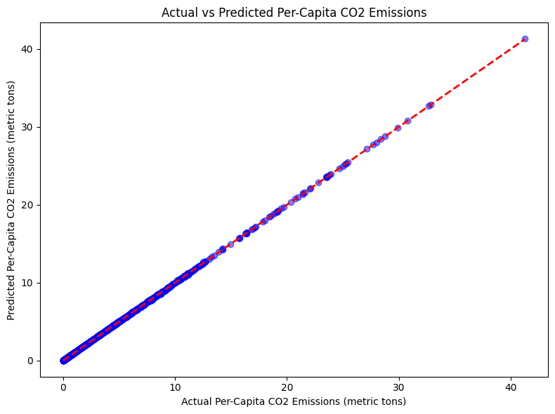

# SDG13-CO2-Prediction
# SDG 13: Predicting Per-Capita CO2 Emissions

This project addresses **UN SDG 13: Climate Action** by predicting per-capita CO2 emissions using linear regression. The model uses data from GCB2022v27_percapita_flat.csv (Kaggle) with features like Coal, Oil, and Gas emissions to predict total per-capita CO2 emissions.

## Project Demo

## Files
- `SDG13_CO2_Emissions_Prediction.ipynb`: Python notebook with the model, preprocessing, evaluation, and visualization.

- # SDG 13: Predicting Per-Capita CO2 Emissions

**SDG Problem Addressed**:
Climate change, addressed by UN Sustainable Development Goal 13 (Climate Action), is exacerbated by rising CO2 emissions. Predicting per-capita CO2 emissions enables policymakers to identify high-emission behaviors at an individual level, facilitating targeted interventions to reduce emissions and promote sustainable development globally.

**Machine Learning Approach**:
This project employs supervised learning with a linear regression model to predict per-capita CO2 emissions (metric tons per person). The dataset, sourced from `GCB2022v27_percapita_flat.csv` on Kaggle, spans 2002–2022 and includes features such as Coal, Oil, Gas, Cement, and Flaring emissions. Data preprocessing involved filtering for recent years, dropping rows with missing values in the target (`Total`) and features, and removing the `Other` column due to significant missing data. The dataset was split into 80% training and 20% testing sets. The model, implemented using Scikit-learn, was evaluated using Mean Absolute Error (MAE) and R2 score to assess predictive accuracy.

**Results**:
The model achieved an MAE of 0.0176 metric tons per capita and an R2 score of 1.0000, indicating exceptional predictive accuracy. Feature importance analysis revealed Cement (coefficient: 1.062), Coal (1.013), and Oil (1.001) as the top drivers of per-capita CO2 emissions. These findings suggest that policies targeting cement production and fossil fuel usage, particularly coal and oil, could significantly reduce emissions.

**Ethical Considerations**:
The dataset may underrepresent emissions from developing countries due to missing or incomplete data, potentially biasing predictions toward wealthier nations with robust reporting. Dropping rows with missing values mitigates this bias but excludes some countries, reducing global inclusivity. The model promotes fairness by focusing on per-capita emissions, which avoids penalizing populous nations and ensures equitable analysis across countries. By highlighting key emission sources like cement and coal, the model supports SDG 13’s goal of sustainable climate action through informed, targeted policy interventions.

**Impact**:
This model contributes to SDG 13 by providing actionable insights into per-capita CO2 emission drivers. Policymakers can use these findings to prioritize reductions in cement production and fossil fuel reliance, fostering a transition to renewable energy and advancing equitable, sustainable climate strategies worldwide.
